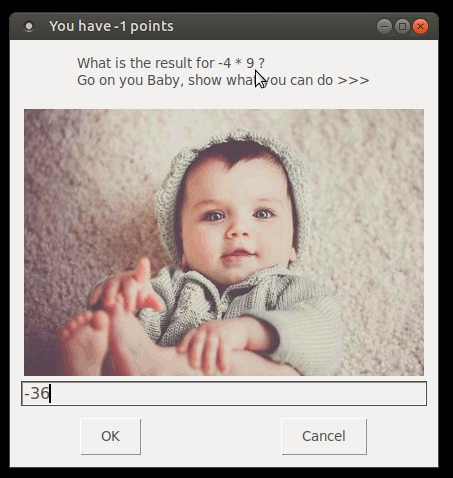
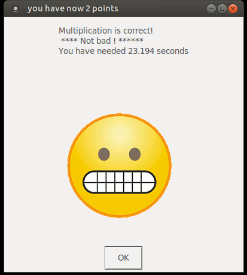
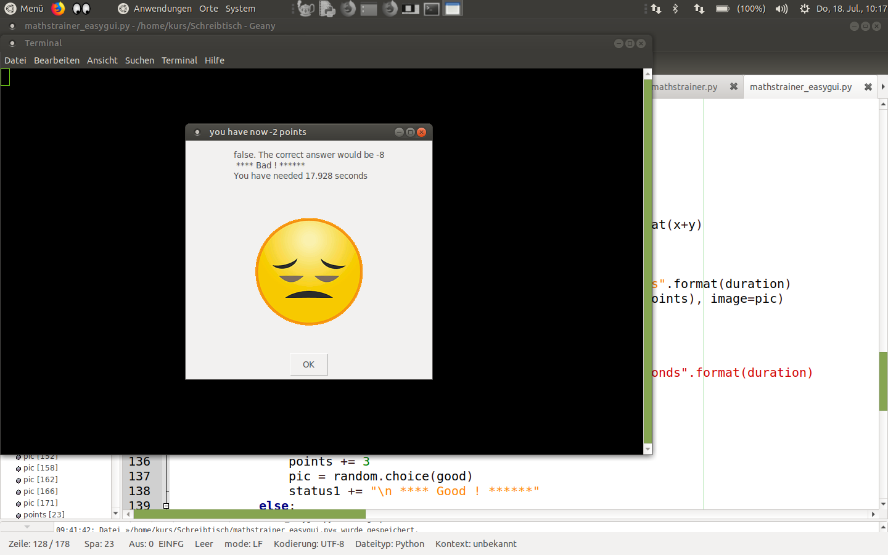

# Mathstrainer

requires [http://python3.org](Python3)

# Mathstrainer_easygui

requires python3 and easygui

  * how to install easygui from linux: 'sudo apt install python3-easygui'  
  * how to install easygui from non-linux: 'pip install easygui' https://pypi.org/project/easygui/ 

